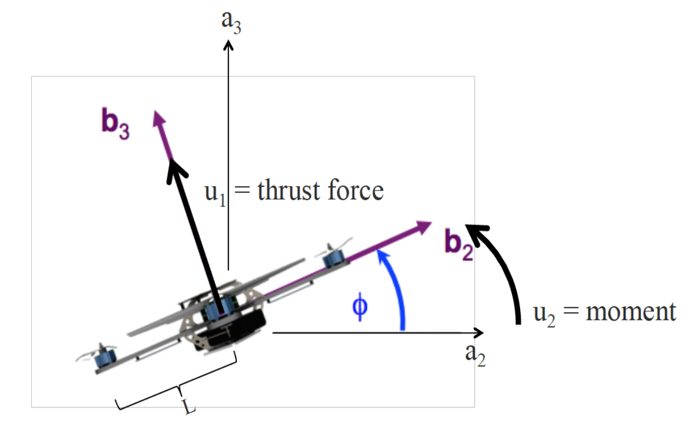

# PD Controller For 2D Quadrotor
This project involves implementing a Proportional-Derivative (PD) control system for a two-dimensional (2D) quadrotor. The objective is to stabilize the quadrotor's position ensuring smooth motion and maintaining the desired trajectory. The PD controller computes corrective actions based on the desired acceleration, position error (the difference between desired and current positions), velocity error (the difference between desired and current velocities), and roll angle error (the difference between desired and current roll angles), allowing for precise control.

## Table of Contents
- [Introduction](#introduction)
   - [Technical Details](#technical-details)
   - [System Model](#system-model)
   - [PD Controller](#pd-controller)
- [Features](#features)
- [Requirements](#requirements)
- [Usage](#usage)
- [File Structure](#file-structure)
- [Results](#results)
- [Future Work](#future-work)
- [License](#license)
- [Acknowledgments](#acknowledgments)
- [References](#references)

## Introduction

The goal of this project is to gain familiarity with quadrotor dynamics and implement a Proportional-Derivative (PD) controller. The PD controller is designed to stabilize the motion of the quadrotor by adjusting the thrust to achieve and maintain a specific trajectory.

### Technical Details  

The physical properties of the quadrotor are:
- Mass ($m$) : 0.18($kg$)
- Lenght of arm ($L$) : 0.086($m$)
- Moment of Inertia ($I_{xx}$) : 0.00025 ($kgm^2$)
  
### System Model

**Figure 1**: Planar quadrotor model and the coordinate systems.

#### Coordinate Systems

The coordinate systems and free body diagram for the planar model of a quadrotor are shown in **Figure 1**. The inertial frame, $\mathcal{A}$, is defined by axes $a_2$ and $a_3$. The body frame, $\mathcal{B}$, is attached to the center of mass of the quadrotor with $b_2$ coinciding with the preferred forward direction and $b_3$ perpendicular to the rotors pointing vertically up (see **Figure 1**).

#### Dynamics

For a quadrotor modeled in the $Y$ − $Z$ plane, its orientation is defined by a roll angle, $\phi$. It is assumed that its pitch and yaw angles are 0. You will need the rotation matrix for transforming components of vectors in $\mathcal{B}$ to components of vectors in $\mathcal{A}$:

$$
\mathcal{A}[R]_\mathcal{B} = 
\begin{bmatrix} \cos(\phi) & -\sin(\phi) \\ 
\sin(\phi) & \cos(\phi) 
\end{bmatrix} 
\quad (1)
$$

We will denote the components of angular velocity of the robot in the body frame by $\dot{\phi}$:

$$
{}^\mathcal{A}\omega_\mathcal{B} = \dot{\phi}
$$

In the planar model of the quadrotor, we only consider the thrust force on two of the rotors. The quadrotor has two inputs: the thrust force ($u_1$) and the moment ($u_2$). $u_1$ is the sum of the thrusts at each rotor

$$
u_1 = \sum_{i=1}^2 F_i,
$$

while $u_2$ is proportional to the difference between the thrusts of two rotors:

$$
u_2 = L(F_1 - F_2)
$$

Here, $L$ is the arm length of the quadrotor.
Let $r = [y,z]^T$ denote the position vector of the planar quadrotor in $\mathcal{A}$. The forces on the system are gravity, in the $−a_3$ direction, and the thrust force, in the b3 direction. Hence, by Newton’s Equations of Motion,

$$
m\ddot{\mathbf{r}} = m
\begin{bmatrix}
\ddot{y} \\
\ddot{z}
\end{bmatrix}
$$

=

$$
\begin{bmatrix}
0 \\
-mg
\end{bmatrix}
$$

$$
+ \mathcal{A}[R]_\mathcal{B}
$$

$$
\begin{bmatrix}
0 \\
u_1
\end{bmatrix}
$$

=

$$
\begin{bmatrix}
0 \\
-mg
\end{bmatrix}
$$

$$
+
$$

$$
\begin{bmatrix}
-u_1 \sin(\phi) \\
u_1 \cos(\phi)
\end{bmatrix}.
$$

The angular acceleration is determined by Euler's equation of motion:

$$
I_{xx}\ddot{\phi} = L(F_1 - F_2) = u_2.
$$

As a result, the system model can be written as:

$$
\begin{bmatrix}
\ddot{y} \\
\ddot{z} \\
\ddot{\phi}
\end{bmatrix}
$$ 

= 

$$
\begin{bmatrix}
0 \\
-g \\
0
\end{bmatrix}
$$

$$
+
$$

$$
\begin{bmatrix}
-\frac{1}{m}\sin(\phi) & 0 \\
\frac{1}{m}\cos(\phi) & 0 \\
0 & \frac{1}{I_{xx}}
\end{bmatrix}
$$

$$
\begin{bmatrix}
u_1 \\
u_2
\end{bmatrix}.
$$

### PD Controller  

In this project, I have implemented a custom PD controller to control the trajectory of quadrotor and tuned $K_p$ and $K_v$ values for four trajectory cases:
1. **Simple Line**
2. **Sine Wave**
3. **Diamond Shape**
4. **Step Input**

## Features  

- **PD Controller Implementation**:  
  Implements a custom Proportional-Derivative (PD) controller to manage the quadrotor's position in trajectory.  

- **Simulation Environment**:  
  Provides a realistic simulation of the quadrotor's dynamics under the control of the PD system.  

- **Graphical User Interface (GUI)**:  
  Includes an interactive GUI for:
  - Simulating the quadrotor's motion.
  - Visualizing the controller's response over time.

## Requirements

- MATLAB (preferably R2018b or later)

## Usage

Clone this repository and run the `line_simulation.m` file for line trajectory, `sine_wave_simulation.m` file for sine wave trajectory, `diamond_shape_simulation.m` file for diamond shape trajectory and `step_input_simulation.m` file for step input trajectory.

## **File Structure**  

The project consists of the following MATLAB functions:

## Results

## Future Work  

The current implementation effectively stabilizes the 1D quadrotor and performs basic position control. However, there are several areas where the system can be enhanced while remaining within the 1D motion framework. These improvements aim to refine control precision, robustness, and adaptability under realistic conditions:  

### 1. **Adaptive Gain Tuning**  
   The fixed proportional ($K_p$) and derivative ($K_v$) gains may not be optimal under varying conditions. Adaptive gain tuning can dynamically adjust these parameters to:  
   - Enhance performance under changing conditions, such as varying payloads or external disturbances.  
   - Reduce overshoot and oscillations for different types of trajectories.  
   Real-time optimization techniques, such as Recursive Least Squares (RLS) or model-based adaptive control, can be employed to achieve this.  

### 2. **Robustness Against Disturbances and Noise**  
   Real-world scenarios often introduce uncertainties, such as external disturbances or sensor noise. To make the system more robust:  
   - **Disturbance Rejection**: Design disturbance observers or use feedforward compensation to counteract known disturbances, such as wind or persistent forces.  
   - **Sensor Noise Handling**: Implement low-pass or Kalman filters to reduce the impact of noise on velocity and position measurements. This is especially important when estimating derivatives, as noise can amplify errors.  

### 3. **Integral Control for Eliminating Steady-State Errors**  
   While the PD controller ensures good transient response, it can leave steady-state errors in scenarios with persistent disturbances (e.g., unmodeled drag). Incorporating an integral term to create a PID controller would:  
   - Accumulate errors over time and adjust control inputs to achieve zero steady-state error.  
   - Improve accuracy when the system operates near its thrust limits.  

### 4. **Trajectory Optimization for Smooth Motion**  
   The current system is tested primarily with step inputs or fixed setpoints. Extending the system to handle optimized trajectories could improve performance by:  
   - Designing time-optimal or smooth trajectories (e.g., splines or polynomials) for transitions between positions.  
   - Ensuring control actions respect the thrust constraints $u_{\text{min}}$ and $u_{\text{max}}\$ while minimizing oscillations and abrupt accelerations.  
   - Balancing response time and precision for practical applications, such as delivery systems or height-following tasks.  

### 5. **Nonlinear Control Strategies**  
   Although the current PD controller works well for linear approximations, the quadrotor dynamics are inherently nonlinear. Nonlinear control methods can provide enhanced performance:  
   - **Feedback Linearization**: Simplify nonlinear dynamics for controller design while ensuring better control fidelity.  
   - **Sliding Mode Control**: Enhance robustness under parameter uncertainties and disturbances.  
   - **Lyapunov-Based Control**: Offer formal stability guarantees while addressing the nonlinear nature of the quadrotor's dynamics.  

### 6. **Model Refinement and Parameter Adaptation**  
   The current model assumes ideal conditions with constant parameters. Enhancing the model can improve control performance:  
   - **Incorporate Additional Dynamics**: Account for unmodeled effects like drag forces or actuator response time.  
   - **Parameter Estimation**: Implement online parameter estimation algorithms to detect and adapt to changes in mass (e.g., varying payloads) or thrust coefficients.  

### 7. **Evaluation in Realistic Scenarios**  
   The system can be further validated by simulating or implementing more realistic conditions:  
   - **Random Disturbances**: Introduce stochastic disturbances, such as fluctuating wind forces, to test robustness.  
   - **Sensor Noise and Latency**: Simulate sensor inaccuracies and delays to evaluate the impact on control performance.  
   - **Extreme Conditions**: Test the system under challenging initial conditions (e.g., large deviations from equilibrium) to evaluate stability margins.  

### 8. **Learning-Based Control Enhancements**  
   Machine learning techniques can further optimize the control system:  
   - **Reinforcement Learning**: Use simulation to train an agent to derive optimal control policies that account for nonlinearities and disturbances.  
   - **Neural Networks**: Approximate the nonlinear dynamics and improve the controller’s ability to respond to complex conditions.  
   - **Supervised Learning**: Use historical data to fine-tune gains or predict required thrust for specific scenarios.  

By focusing on these areas, the @D quadrotor control system can become more adaptable, precise, and robust for real-world applications without the need to expand into higher dimensions.

## License

This project is licensed under the MIT License. See the LICENSE file for details.

## Acknowledgments

Inspired by the course Aerial Robotics offered by the University of Pennsylvania on Coursera.

## References

- MATLAB Documentation:
   - [ODE45](https://www.mathworks.com/help/matlab/ref/ode45.html)
   - [Graphics](https://www.mathworks.com/help/matlab/graphics.html)
   - [OpenGL](https://www.mathworks.com/help/matlab/ref/opengl.html)
- Coursera Course [Aerial Robotics by University of Pennsylvania](https://www.coursera.org/learn/robotics-flight)
- Control Theory Concepts: K. Ogata, Modern Control Engineering, Prentice Hall
